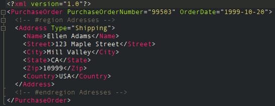
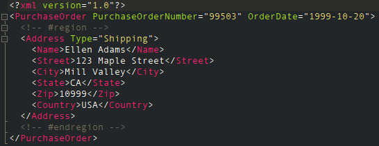
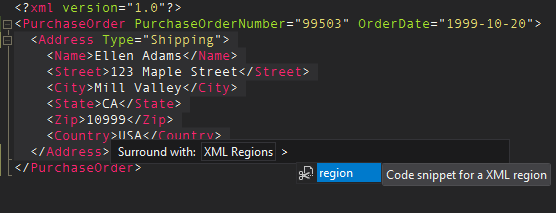
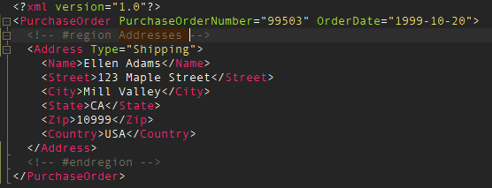

# XML Regions

[](https://ci.appveyor.com/project/tobiashein/xmlregions)
[](https://marketplace.visualstudio.com/items?itemName=TobiasHein.XmlRegions)
[](https://paypal.me/niehsaibot)

A Visual Studio extension that adds support for regions in XML files.

You can download the extension from the [Visual Studio Marketplace](https://marketplace.visualstudio.com/items?itemName=TobiasHein.XmlRegions) or get the latest [CI build](https://ci.appveyor.com/project/tobiashein/xmlregions/build/artifacts). 
See the [change log](https://github.com/tobiashein/XmlRegions/blob/master/CHANGELOG.md) for the latest changes.

## Features

- Region outlining
- Display region name in collapsed mode
- Snippet for inserting regions

### Outlining

To insert a region simply surround the required lines with the following XML comments.

```xml
<!-- #region -->
...
<!-- #endregion -->
```

Named regions are support by providing a name within the XML comment. Providing a name in the closing XML comment is optional.

```xml
<!-- #region My Region -->
...
<!-- #endregion My Region -->
```
 




### Snippet

A code snippet to quickly insert new regions is provided.





## Release Notes

### v1.1.0

- Add support for Visual Studio 2022

### v1.0.0

- Initial release

## License

[MIT](https://github.com/tobiashein/XmlRegions/blob/master/LICENSE)

Icon by Michael Irigoyen ([@mririgo](http://twitter.com/mririgo))

Inspired by [XAML Regions](https://marketplace.visualstudio.com/items?itemName=JacobJohnston.XAMLRegions) and [JavaScriptRegions](https://marketplace.visualstudio.com/items?itemName=MadsKristensen.JavaScriptRegions)
